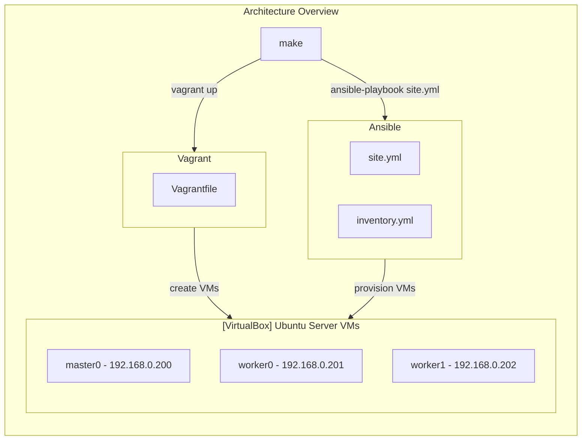

# k3s-virtualbox
This project makes it easy to create single- and multi-node [k3s cluster](https://k3s.io) in VirtualBox, e.g. for local development on Kubernetes.

My inspirations for this project:
- [k3d](https://github.com/k3d-io/k3d) (the idea is pretty similar, but it uses containers which are much more lightweight compared to virtual machines)
- [khuedoan/homelab](https://github.com/khuedoan/homelab) (uses physical servers as nodes)

# Overview



| Demo                                                                                        |
| :--:                                                                                        |
| [![][virtualbox-demo]][homepage-demo]                                                       |
| Virtual machines created via [Vagrant](https://www.vagrantup.com/)                          |
| [![][homepage-demo]][homepage-demo]                                                         |
| Homepage with Ingress discovery powered by [Hajimari](https://hajimari.io/)                 |
| [![][argocd-demo]][argocd-demo]                                                             |
| Continuous deployment with [ArgoCD](https://argoproj.github.io)                             |

[virtualbox-demo]: images/virtualbox.png
[homepage-demo]: images/hajimari.png
[argocd-demo]: images/argocd.png

# Setup VMs & k3s cluster
- Clone this repository
- Replace `default_interface` in `Vagrantfile` with the name of your host's main network interface  
- Edit `inventory.yml`. If your home network subnet is different than `192.168.0.0/24` then you have to update IPs. You can also change the number of worker nodes (only 1 master node is supported for now).
- Linux (not tested)
    - Install VirtualBox, kubectl, vagrant, ansible
- Windows
    - Install VirtualBox, [WSL2](https://docs.microsoft.com/en-us/windows/wsl/install)
    - Create Ubuntu distribution: `wsl --install -d ubuntu` (because you can't install Ansible on Windows)
    - Convert distribution to use WSL2: `wsl --set-version ubuntu 2`
    - Enter the machine `wsl -d Ubuntu`
    - Install ansible, kubectl
    - Install vagrant and configure it to work with VirtualBox that is installed on the host. Helpful resources:
        - [vagrant up – Running Vagrant under WSL2](https://thedatabaseme.de/2022/02/20/vagrant-up-running-vagrant-under-wsl2/)
        - [Vagrant and Windows Subsystem for Linux](https://www.vagrantup.com/docs/other/wsl)
- `ssh-keygen` - generate `~/.ssh/id_rsa` and `~/.ssh/id_rsa.pub` keys. Vagrant will append `id_rsa.pub` to `~/.ssh/authorized_keys` of each VM so that VMs will be accessible over SSH.
- `vagrant plugin install vagrant-timezone`
- `make` - this command will create declared virtual machines (via Vagrant) and then provision them (via Ansible)
- after a while, the cluster should be set up
```bash
$ kubectl get nodes
NAME      STATUS   VERSION        INTERNAL-IP        OS-IMAGE            CONTAINER-RUNTIME
master0   Ready    v1.25.0+k3s1   192.168.0.200    Ubuntu 22.04.1 LTS    containerd://1.6.8-k3s1
worker0   Ready    v1.25.0+k3s1   192.168.0.201    Ubuntu 22.04.1 LTS    containerd://1.6.8-k3s1
worker1   Ready    v1.25.0+k3s1   192.168.0.202    Ubuntu 22.04.1 LTS    containerd://1.6.8-k3s1
```


# Usage
The cluster is ready. Now you can deploy some apps.
- `make argocd` - deploy ArgoCD, wait for it be ready and then configure it to deploy apps declared inside the [cluster/apps folder](https://github.com/erykio/k3s-virtualbox/tree/master/cluster/apps)
- wait until argocd deploys metallb and ingress
- when `make ingressip` returns `192.168.0.200` then you should be able to access:
    - [The cluster homepage](http://home.192-168-0-200.nip.io/)
    - [ArgoCD dashboard](http://argocd.192-168-0-200.nip.io/) (admin/admin)


# Tech stack

<table>
    <tr>
        <th>Logo</th>
        <th>Name</th>
        <th>Description</th>
    </tr>
    <tr>
        <td></td>
        <td><a href="https://en.wikipedia.org/wiki/Windows_Subsystem_for_Linux">WSL2</a></td>
        <td>Windows Subsystem for Linux </td>
    </tr>
    <tr>
        <td></td>
        <td><a href="https://www.virtualbox.org/">VirtualBox</a></td>
        <td>Virtualization</td>
    </tr>
    <tr>
        <td></td>
        <td><a href="https://www.vagrantup.com/">Vagrant</a></td>
        <td>Automate VM creation in Virtualbox</td>
    </tr>
    <tr>
        <td></td>
        <td><a href="https://www.ansible.com">Ansible</a></td>
        <td>Automate VM provisioning and configuration</td>
    </tr>
    <tr>
        <td></td>
        <td><a href="https://ubuntu.com/download/server">Ubuntu Server</a></td>
        <td>Base OS for VMs</td>
    </tr>
    <tr>
        <td></td>
        <td><a href="https://k3s.io">K3s</a></td>
        <td>Lightweight distribution of Kubernetes</td>
    </tr>
    <tr>
        <td></td>
        <td><a href="https://github.com/alexellis/k3sup">k3sup</a></td>
        <td>Bootstrap K3s over SSH</td>
    </tr>
    <tr>
        <td></td>
        <td><a href="https://helm.sh">Helm</a></td>
        <td>The package manager for Kubernetes</td>
    </tr>
    <tr>
        <td></td>
        <td><a href="https://argoproj.github.io">ArgoCD</a></td>
        <td>GitOps continuous delivery tool for Kubernetes</td>
    </tr>
    <tr>
        <td></td>
        <td><a href="https://metallb.org">MetalLB</a></td>
        <td>Bare metal load-balancer for Kubernetes</td>
    </tr>
    <tr>
        <td></td>
        <td><a href="https://kubernetes.github.io/ingress-nginx/">NGINX Ingress Controller</a></td>
        <td>Kubernetes Ingress Controller</td>
    </tr>
    <tr>
        <td></td>
        <td><a href="https://github.com/mermaid-js/mermaid">mermaid</a></td>
        <td>JavaScript-based diagramming and charting tool</td>
    </tr>
</table>