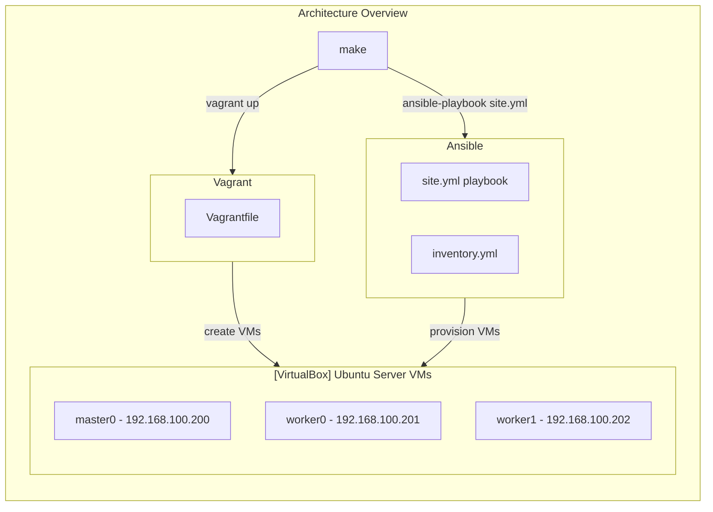

# k3s-virtualbox-cluster-bootstraper
This project makes it very easy to create single- and multi-node k3s clusters in VirtualBox, e.g. for local development on Kubernetes.

My inspirations for this project:
- [k3d](https://github.com/k3d-io/k3d) (the idea is pretty similar, but it uses containers which are much more lightweight compared to virtual machines)
- [khuedoan/homelab](https://github.com/khuedoan/homelab) (uses physical servers as nodes)


# Usage
- Clone this repository
- Replace `default_interface` in `Vagrantfile` with the name of your host's main network interface  
- Edit `inventory.yml`. Most certainly you will have to adjust IPs to match your home network subnet. You can also change the number of nodes
```yaml
all:
  children:
    masters:
      hosts:
        master0:
          ansible_host: 192.168.100.200
          memory: 1024
          cpu: 1
    workers:
      hosts:
        worker0:
          ansible_host: 192.168.100.201
          memory: 1024
          cpu: 1
        worker1:
          ansible_host: 192.168.100.202
          memory: 1024
          cpu: 1
```
- Linux
    - Install docker, VirtualBox, vagrant, ansible
- Windows 🤦‍♂️😂
    - Install VirtualBox
    - If you are on Windows, ansible won't work. Install Docker Desktop with [WSL2](https://docs.microsoft.com/en-us/windows/wsl/install)
    - Create Ubuntu distribution: `wsl --install -d ubuntu`
    - Convert distribution to use WSL2: `wsl --set-version ubuntu 2`
    - Docker desktop → Settings → Resources → WSL integration → Enable integration for Ubuntu
    - Enter the machine `wsl -d Ubuntu`
    - Check if Docker integration is working: `docker run hello-world`
    - Install ansible
    - Install vagrant and configure it to work with VirtualBox that is installed on the host. Helpful resources:
        - [vagrant up – Running Vagrant under WSL2](https://thedatabaseme.de/2022/02/20/vagrant-up-running-vagrant-under-wsl2/)
        - [Vagrant and Windows Subsystem for Linux](https://www.vagrantup.com/docs/other/wsl)
- `ssh-keygen -C wsl2` - generate `~/.ssh/id_rsa` and `~/.ssh/id_rsa.pub` keys. Vagrant will append `id_rsa.pub` to `~/.ssh/authorized_keys` of each VM so that each VM will be accessible over SSH.
- `make` - this command will use Vagrant to create declared virtual machines and then provision them via Ansible
- after a few minutes, the cluster should be set up and in the current directory `kubeconfig` should be created
- install kubectl
- verify the cluster is running:

```bash
$ kubectl get nodes --kubeconfig=./kubeconfig
NAME      STATUS   ROLES                  AGE     VERSION
worker0   Ready    <none>                 4m19s   v1.25.0+k3s1
master0   Ready    control-plane,master   33m     v1.25.0+k3s1
worker1   Ready    <none>                 3m      v1.25.0+k3s1
```




# Tech stack

<table>
    <tr>
        <th>Logo</th>
        <th>Name</th>
        <th>Description</th>
    </tr>
    <tr>
        <td></td>
        <td><a href="https://en.wikipedia.org/wiki/Windows_Subsystem_for_Linux">WSL2</a></td>
        <td>Windows Subsystem for Linux </td>
    </tr>
    <tr>
        <td></td>
        <td><a href="https://www.virtualbox.org/">VirtualBox</a></td>
        <td>Virtualization</td>
    </tr>
    <tr>
        <td></td>
        <td><a href="https://www.vagrantup.com/">Vagrant</a></td>
        <td>Automate VM creation in Virtualbox</td>
    </tr>
    <tr>
        <td></td>
        <td><a href="https://www.ansible.com">Ansible</a></td>
        <td>Automate VM provisioning and configuration</td>
    </tr>
    <tr>
        <td></td>
        <td><a href="https://ubuntu.com/download/server">Ubuntu Server</a></td>
        <td>Base OS for VMs</td>
    </tr>
    <tr>
        <td></td>
        <td><a href="https://k3s.io">K3s</a></td>
        <td>Lightweight distribution of Kubernetes</td>
    </tr>
    <tr>
        <td></td>
        <td><a href="https://github.com/alexellis/k3sup">k3sup</a></td>
        <td>Bootstrap K3s over SSH</td>
    </tr>
    <tr>
        <td></td>
        <td><a href="https://github.com/mermaid-js/mermaid">mermaid</a></td>
        <td>JavaScript-based diagramming and charting tool</td>
    </tr>
    <!-- <tr>
        <td></td>
        <td><a href="https://helm.sh">Helm</a></td>
        <td>The package manager for Kubernetes</td>
    </tr>
    <tr>
        <td></td>
        <td><a href="https://metallb.org">MetalLB</a></td>
        <td>Bare metal load-balancer for Kubernetes</td>
    </tr>
    <tr>
        <td></td>
        <td><a href="https://www.nginx.com">NGINX</a></td>
        <td>Kubernetes Ingress Controller</td>
    </tr> -->
</table>